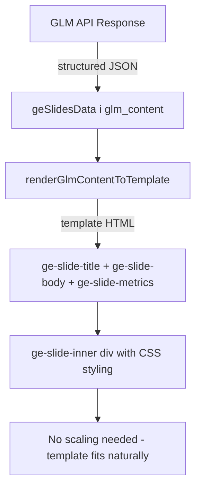

# Plan: Switch GLM from Full HTML Design to Structured Content + Templates

## Current Architecture

```
Backend: CONDENSED_DESIGN_PROMPT → GLM returns {title, html} with full inline CSS
Frontend: geSlidesData[i].glm_html = raw HTML → rendered via glm-designed class + fitGlmSlides() scaling
```

GLM currently generates **complete visual HTML** (1280x720 div with all inline styles, colors, fonts, layouts). This is fragile, hard to maintain, and causes the scaling bugs we've been fighting.

## Target Architecture

```
Backend: NEW_PROMPT → GLM returns {title, subtitle, bullets, metrics} structured JSON
Frontend: geSlidesData[i].glm_content = {title, subtitle, bullets, metrics} → rendered via CSS template
```

GLM will only generate **structured content data**. The existing CSS template (`ge-slide-title`, `ge-slide-subtitle`, `ge-slide-body`, `ge-slide-metrics`) handles all visual presentation.

---

## Detailed Changes

### 1. Backend: New Content Prompt (app.py)

**Delete:**
- `DESIGN_VARIATIONS` array (lines 1629-1642) — no more design variations
- `CONDENSED_DESIGN_PROMPT` (lines 1644-1680) — no more full-HTML prompt

**Add new prompt:**
```python
CONTENT_PROMPT = """You are a content writer for investment presentation slides at "منافع الاقتصادية للعقار".
RTL layout. Arabic text only. ALL text alignment RIGHT.

Return ONLY valid JSON with this structure:
{
  "slides": [{
    "title": "Slide title in Arabic",
    "subtitle": "Optional subtitle",
    "bullets": ["Bullet point 1", "Bullet point 2", ...],
    "metrics": [{"label": "Metric name", "value": "Metric value"}, ...]
  }]
}

RULES:
1. Use EXACT text from the slide description — do NOT paraphrase or abbreviate
2. bullets: array of strings for body content (use for lists, descriptions, features)
3. metrics: array of {label, value} pairs for financial data, KPIs, numbers
4. Keep bullets concise — max 6 items, each under 60 chars
5. For cover slides (index 0): title = project name, subtitle = type + city
6. For closing slides (last): title = "شكراً لكم", subtitle = project name
7. Do NOT generate any HTML, CSS, or styling — only structured data
"""
```

**Modify `_generate_single_slide()` (line 1683):**
- Replace prompt with `CONTENT_PROMPT`
- Parse response as structured data
- Return `{'idx': idx, 'success': True, 'content': {title, subtitle, bullets, metrics}, 'title': title}`

**Modify SSE event data (line 1902-1911):**
- Change `'html': result.get('html', '')` to `'content': result.get('content', {})`
- Keep `'title'` as-is

**Delete `_generate_single_slide_legacy()` (line 1746):** — dead code

### 2. Frontend: Store Structured Data (index.html)

**Replace `glm_html` with `glm_content` throughout:**

| Location | Current | New |
|----------|---------|-----|
| `geSlidesData` storage | `s.glm_html = normalizeGlmRoot(...)` | `s.glm_content = {title, subtitle, bullets, metrics}` |
| SSE handler | `geSlidesData[idx].glm_html = normalizeGlmRoot(...)` | `geSlidesData[idx].glm_content = eventData.content` |
| AI edit handlers | `result.html` → `normalizeGlmRoot(...)` | `result.content` → structured data |
| Migration | `s.glm_html = normalizeGlmRoot(s.glm_html)` | Remove (no migration needed) |
| Fallback | `if (!geSlidesData[i].glm_html)` | `if (!geSlidesData[i].glm_content)` |

### 3. Frontend: Render via Template

**Modify `renderAllSlides()` — remove the `s.glm_html` branch (lines 4443-4452):**

All slides now render through the same template path. The existing `buildFallbackSlideHtml()` already generates the correct template HTML. When `glm_content` exists, update `s.content` from structured data before rendering.

**Add new function `renderGlmContentToTemplate(glmContent, slideData)`:**
```javascript
function renderGlmContentToTemplate(glmContent, slideData) {
  if (!glmContent) return slideData.content || '';
  var html = '<div class="ge-slide-title">' + (glmContent.title || slideData.title || '') + '</div>';
  if (glmContent.subtitle) {
    html += '<div class="ge-slide-subtitle">' + glmContent.subtitle + '</div>';
  }
  if (glmContent.bullets && glmContent.bullets.length > 0) {
    html += '<div class="ge-slide-body"><ul>' +
      glmContent.bullets.map(function(b) { return '<li>' + b + '</li>'; }).join('') +
      '</ul></div>';
  }
  if (glmContent.metrics && glmContent.metrics.length > 0) {
    html += '<div class="ge-slide-metrics">' +
      glmContent.metrics.map(function(m) {
        return '<div class="ge-metric"><div class="ge-metric-label">' + m.label + '</div><div class="ge-metric-value">' + m.value + '</div></div>';
      }).join('') +
      '</div>';
  }
  return html;
}
```

**In `generateGlidesDesign()` SSE handler:**
```javascript
// Before: geSlidesData[idx].glm_html = normalizeGlmRoot(replaceImagePlaceholders(eventData.html));
// After:  geSlidesData[idx].glm_content = eventData.content;
```

Then after SSE completes, update all `s.content` from `glm_content`:
```javascript
geSlidesData.forEach(function(s) {
  if (s.glm_content) {
    s.content = renderGlmContentToTemplate(s.glm_content, s);
  }
});
```

### 4. Frontend: Remove GLM Design CSS/JS

**Delete CSS (lines ~1304-1340):**
- `.ge-slide-inner.glm-designed` — entire rule block
- `.ge-slide-inner.glm-designed > div` — entire rule block
- `.ge-slide-inner.glm-designed>div *` — entire rule block

**Delete JS functions:**
- `normalizeGlmRoot()` (line 4303-4346)
- `fitGlmSlides()` (line 4507-4511)
- `window.addEventListener('resize', fitGlmSlides)` (line 4512)

**Delete CSS variable references:**
- `--glm-scale` in CSS and JS

**Remove from `renderGeSidebar()`:**
- The `s.glm_html` branch (lines 4377-4394) — thumbnails use same template

**Remove from `renderAllSlides()`:**
- The `s.glm_html` branch (lines 4443-4452) — main slides use same template

**Remove `requestAnimationFrame(fitGlmSlides)` calls.**

### 5. Frontend: Update AI Edit Flow

**Current:** AI edit sends `glm_html` to backend, backend redesigns full HTML, returns new HTML
**New:** AI edit sends structured content, backend refines structured content, returns new structured data

Modify `applyGeChatEdit()` to send `glm_content` instead of `glm_html`.
Modify the redesign API response handler to update `glm_content` instead of `glm_html`.

### 6. Frontend: Update PDF Export

**Current:** `exportPdfFromGenEdit()` uses `normalizeGlmRoot(slideData.glm_html)` for 1280x720 rendering
**New:** Render template HTML into offscreen div for html2canvas capture

The existing `renderGlmContentToTemplate()` produces the same template HTML that `buildFallbackSlideHtml()` already generates. PDF export can use this directly.

---

## Render Flow (After)



## Data Flow (After)

```mermaid
flowchart LR
    A[Outline Data] -->|title + bullets| B[GLM API]
    B -->|{title, subtitle, bullets, metrics}| C[glm_content stored]
    C --> D[renderGlmContentToTemplate]
    D --> E[CSS Template HTML]
    E --> F[Rendered Slide Card]
```

---

## Files Modified

| File | Changes |
|------|---------|
| `app.py` | New `CONTENT_PROMPT`, modify `_generate_single_slide()`, update SSE events, delete legacy |
| `index.html` | Remove GLM design CSS/JS, add template renderer, update all `glm_html` → `glm_content` |

## Acceptance Criteria

1. GLM generates structured JSON only (no HTML in response)
2. All slides render via CSS template (ge-slide-title, ge-slide-body, ge-slide-metrics)
3. No `glm_html`, `glm-designed`, `normalizeGlmRoot`, `fitGlmSlides`, `--glm-scale` in codebase
4. Thumbnails and main slides use same rendering path
5. PDF export captures template-rendered slides correctly
6. AI edit works with structured content
7. Resize works naturally (no scaling hacks needed)
